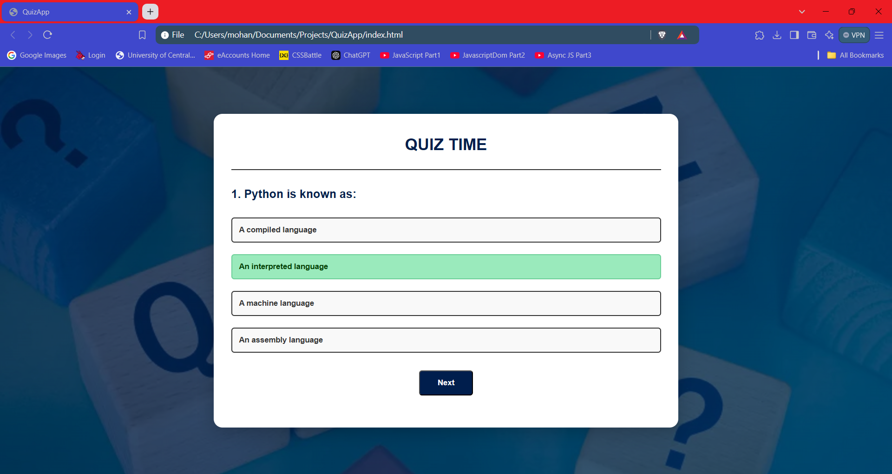
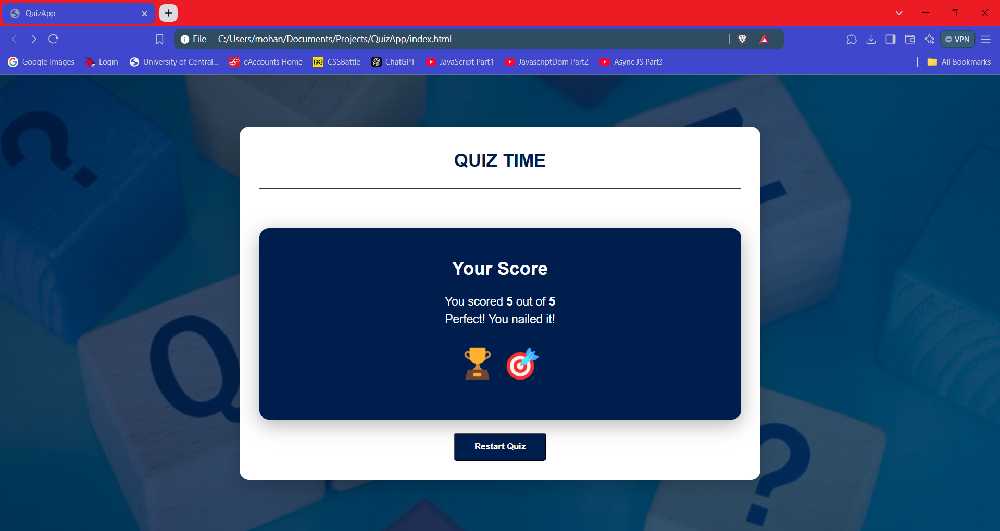

# QuizApp 🎉

QuizApp is a simple and interactive web-based quiz application built with **HTML**, **CSS**, and **JavaScript**. It allows users to answer multiple-choice questions, displays immediate feedback, and calculates the final score in a stylish and engaging way. You can try again, by clicking the restart button.

---

## **Features**

- 📖 **Dynamic Questions:** The quiz dynamically loads questions from an array.
- 🎨 **Stylish UI:** A clean and modern design with smooth animations.
- ✅ **Immediate Feedback:** Highlights correct and incorrect answers.
- 📊 **Score Display:** Shows a final score with emojis and motivational messages.
- 🔄 **Restart Option:** Users can restart the quiz to try again.

---

## **Screenshots**

| Quiz Screen                | Score Screen                   |
|----------------------------|--------------------------------|
|  |  |

---

## **How It Works**

1. Users start the quiz and answer the displayed questions.
2. After each question, the correct and incorrect answers are highlighted.
3. At the end of the quiz, the user’s score is displayed with emojis and motivational text.
4. A restart button allows users to retake the quiz.

---

## **Technologies Used**

- **HTML:** For the structure of the app.
- **CSS:** For styling and animations.
- **JavaScript:** For the quiz logic and interactivity.

# Thank You

